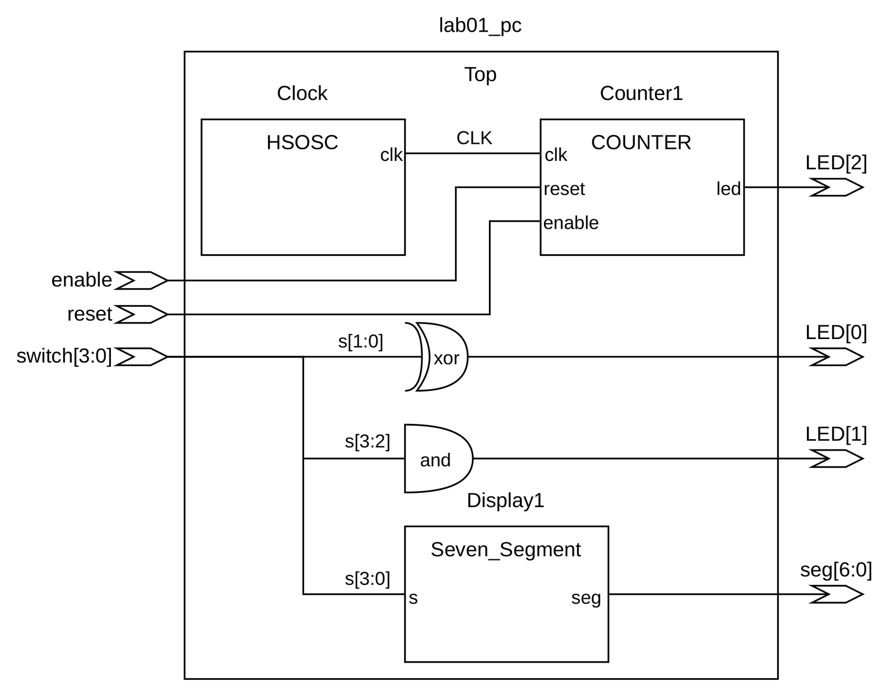
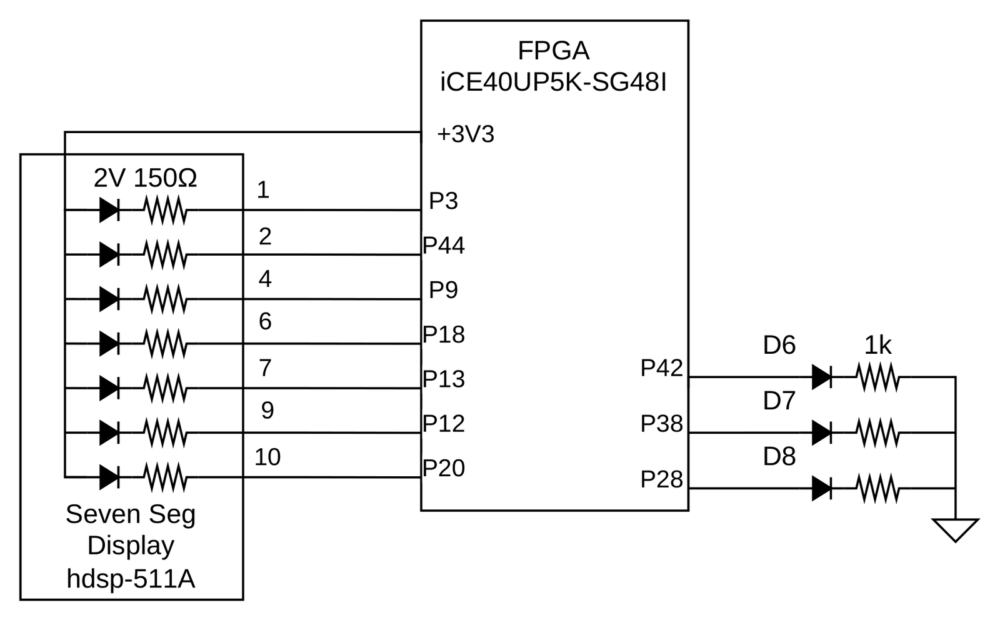
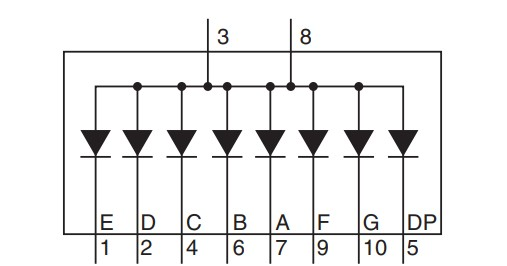
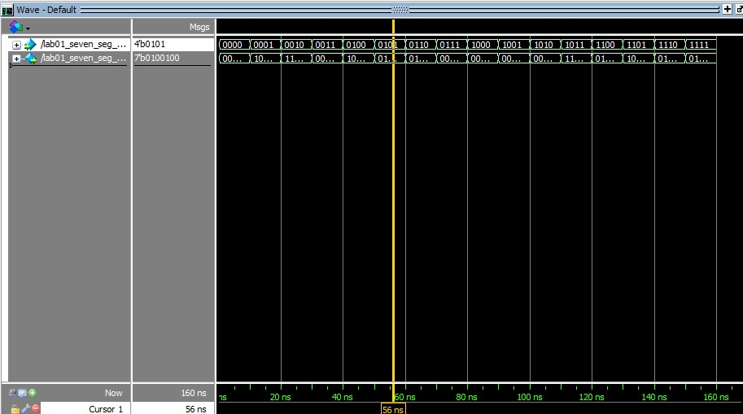
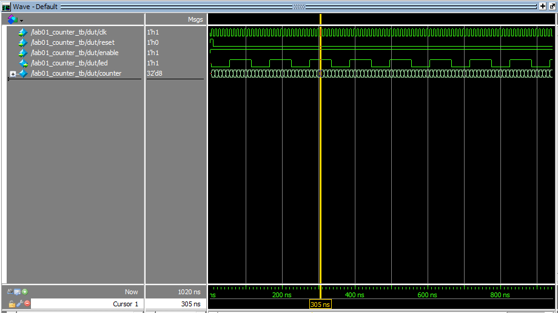

## Introduction

In this lab, a design was implemented on the Lattice iCE40 UP5K to practice basic FPGA programming. The on-board 48 MHz high-speed oscillator was divided down with a counter to blink an on-board LED at ~2.4 Hz. Four on-board switches drove a seven segment display and two additional on-board LEDs.

## Design and Testing Methodology

The on-board high-speed oscillator, HSOSC, from the iCE40 UltraPlus primitive library generated a 48 MHz clock. A counter divided that clock to drive one on-board LED, and combinational logic on the switch bits drove the other two.

The seven segment display module took 4 on-board switches as input and used case logic to select the segment pattern for the matching hexadecimal character.

Testbenches were written for every module, sweeping all inputs where that was feasible.

## Technical Documentation

The source code for the project can be found in the associated [Github repository](https://github.com/pclarkhmc/e155).

### Block Diagram

<details>
<summary>Show block diagram</summary>



</details>

The block diagram in Figure 1 shows the overall architecture of the design. The top level module includes 3 submodules which contain the HSOSC, counter divider, and display logic.

### Schematic

<details>
<summary>Show schematic</summary>



</details>

Figure 2 shows the physical layout. The display is powered from the 3.3 V pin, and the FPGA pins ground each segment to light it. 1 kΩ series resistors limit the on-board LED currents, and 150 Ω resistors limit the seven-segment current, keeping both within the FPGA I/O and display ratings.

### Clock Divider Calculations

The HSOSC module runs at its default rate of $f_{clk} = 48\text{ MHz}$. A counter counts to $N = 20{,}000{,}000$ and resets, and the LED is on whenever the count is greater than $\frac12 N$, so one full on/off cycle takes $N$ clock cycles:

$$
f_{blink} = \frac{f_{clk}}{N} = \frac{48 \times 10^6\text{ Hz}}{20 \times 10^6} = 2.4\text{ Hz}
$$

That matches the rate specified in the lab guide and the rate observed on the board.

### Seven Segment Circuit Calculations



.](images/FIvsFV7Seg.jpg)

Each segment of the display is an LED with an absolute maximum current rating of 30 mA. The circuit was designed for a target current of $I = 8\text{ mA}$.

Each segment of the display is driven from the 3.3 V pin, $V_{cc} = 3.3\text{ V}$, and has a diode forward voltage of $V_f = 1.8\text{ V}$ at the target current, as shown in Figure 4. The remaining voltage is dropped across the current-limiting series resistor:

$$
V_R = V_{cc} - V_f = 3.3\text{ V} - 1.8\text{ V} = 1.5\text{ V}
$$

Applying Ohm's law across the resistor gives the required resistance:

$$
R = \frac{V_R}{I} = \frac{1.5\text{ V}}{8\text{ mA}} = 187.5\,\Omega
$$

A standard $150\,\Omega$ resistor was used in the final design. It draws $1.5\text{ V} / 150\,\Omega = 10\text{ mA}$ per segment, which is slightly above the 8 mA target but still well under the 30 mA maximum rating.

## Results and Discussion

### Testbench Simulation

<details>
<summary>Show testbench simulations</summary>





</details>

Figures 5 and 6 show the QuestaSim results. The seven segment testbench swept all 16 input combinations, and each one produced the expected segment pattern. In the counter testbench the LED output followed the counter, staying high for the top half of each cycle. The counter in the testbench was given a cycle length of ten clock cycles to demonstrate the reset functionality.

## Conclusion

The design implemented all three LED behaviors. The on-board high-speed oscillator blinked the on-board LED, and the seven segment display showed all 16 outputs correctly. This lab took at least 20 hours.

## Lab 1 AI Prototype

As part of this lab, an AI coding assistant was prompted to generate a SystemVerilog implementation of a similar circuit. The model used was Claude Opus 5.

<details>
<summary>Show prompt and generated code</summary>

**Prompt:**

> Write SystemVerilog HDL to leverage the internal high speed oscillator in the Lattice UP5K FPGA and blink an LED at 2 Hz. Take full advantage of SystemVerilog syntax, for example, using logic instead of wire and reg.

**Response:**

The UP5K's internal high-frequency oscillator is instantiated as the `HSOSC` primitive. It exposes a `CLKHF_DIV` parameter that divides its nominal 48 MHz output by 1, 2, 4, or 8; `"0b01"` selects divide-by-2, yielding a 24 MHz reference clock. A free-running counter then toggles the LED every `CLK_FREQ_HZ / (BLINK_FREQ_HZ * 2)` cycles, so the LED's *toggle* rate produces a visible 2 Hz blink (one full on/off period every 0.5 s). The module uses `logic` throughout instead of `wire`/`reg`, `always_ff` to make the sequential intent explicit, and `localparam` with `$clog2` to size the counter automatically instead of hard-coding a bit width.

```systemverilog
module top (
    output logic led
);

    // Internal oscillator: 48 MHz nominal, divided by 2 -> 24 MHz
    logic clk_hf;

    HSOSC #(
        .CLKHF_DIV("0b01")
    ) hf_osc_inst (
        .CLKHFPU (1'b1),
        .CLKHFEN (1'b1),
        .CLKHF   (clk_hf)
    );

    // Toggle the LED once every (CLK_FREQ_HZ / (BLINK_FREQ_HZ * 2)) cycles
    // so that a full on/off period elapses at BLINK_FREQ_HZ.
    localparam int unsigned CLK_FREQ_HZ   = 24_000_000;
    localparam int unsigned BLINK_FREQ_HZ = 2;
    localparam int unsigned TOGGLE_COUNT  = CLK_FREQ_HZ / (BLINK_FREQ_HZ * 2);
    localparam int unsigned COUNTER_WIDTH = $clog2(TOGGLE_COUNT);

    logic [COUNTER_WIDTH-1:0] count = '0;
    logic                     led_reg = 1'b0;

    always_ff @(posedge clk_hf) begin
        if (count == TOGGLE_COUNT - 1) begin
            count   <= '0;
            led_reg <= ~led_reg;
        end else begin
            count <= count + 1'b1;
        end
    end

    assign led = led_reg;

endmodule
```

</details>

Overall, the generated code was correct in its structure and module instantiation. The counter math was correct. The AI used correct SystemVerilog idioms like `always_ff` for the counter and stuck to logic throughout.
